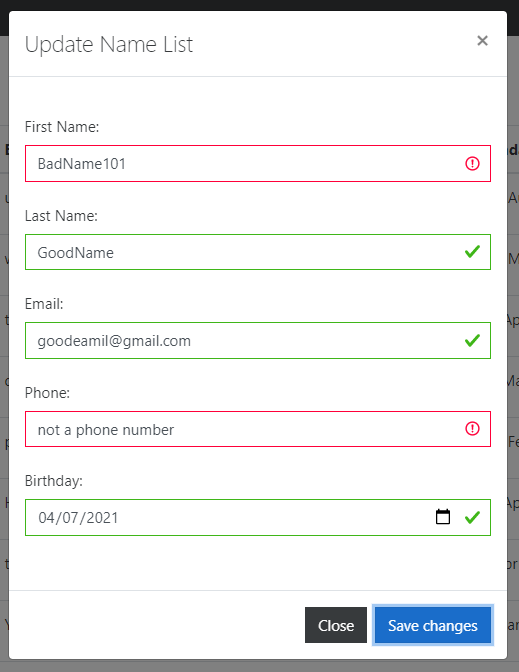
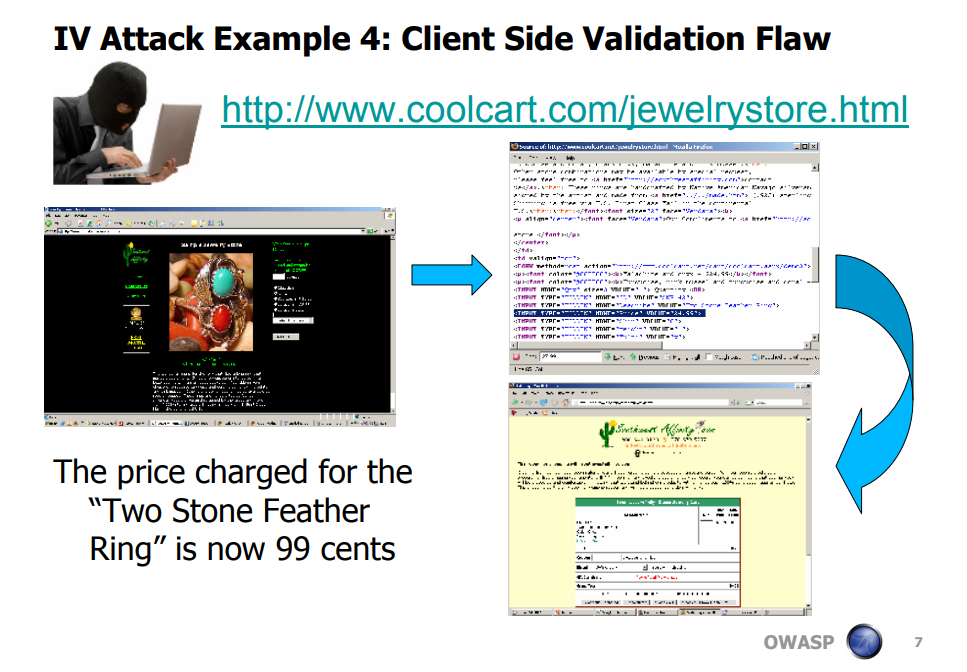
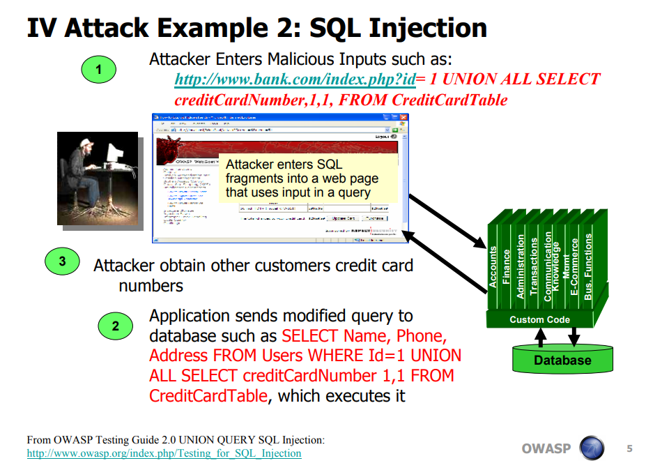
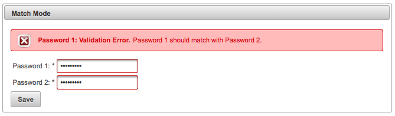

=================================================================
Safe Communication Between the Client and Server
=================================================================

The world was changed when the **internet** was created. The internet is a
system which allows
separate computer networks to communicate. Even its inventors had no
idea how big it would grow. One thing that was born from the creation of the
internet was the **world wide web**, or **web** for short. The web is a group of
interconnected webpages hosted on servers that are accessible to the public.
Access to the web if provided through the internet.

While the web allowed anyone in the world to access your server, that meant
there would be hackers looking to exploit any server vulnerabilities. Even to
this day, developers are still in constant battle trying to keep user's private
information safe from malicious users. Most websites on the web
have preventive measures against hackers hiding in the background
that not many people know about.

-----------------------
The Client-Server Model
-----------------------

The **client-server model** is the basis in which a **server** communicates to
many **clients** [#f1]_. A server is a computer that manages resources in a
network, and a client is a computer that communicates to a server. An example
of the client-server model is the web. Servers host websites which clients
retrieve and display within browsers. There are instances of the client-server
model appearing outside of the web as well. As example, in online multiplayer
games, the players are the client. Online gamers, send information of
their inputs to the server which the server sends back information back to all
of the clients, such as opponent player location and the game state.

There are many reasons why we use the client-server model. One of the reasons
is reducing the amount of data redundancy. Rather than have all the data stored
on all of the clients, it is much more efficient in terms of storage to share
data from the server between all the clients.
However, needing clients to access information over a network is less efficient
than accessing it locally. The client-server model is also useful for updating
information, needing only to update the code on the server rather than
every client. It can also be used to synchronize data between every client.
When no issues arise, maintaining a client-server model usually costs less to
maintain than other models. But the costs for maintenance can be high if the
server goes down.

.. figure:: internetserver.jpg
   :width: 500

"Client Server Model" Image from W3Schools [#f3]_

How the Client Accesses the Server
++++++++++++++++++++++++++++++++++

In order for clients to connect to servers, clients must request a connection.
How the connection is handled is determined by the **protocol**.
Protocols refers to the set of rules that determine how data is transmitted
between devices in the same network [#f13]_.
Protocols are made for a specific purpose, and some protocols have been extended
to create new protocols. Some examples of commonly used protocols are HTTPS, SMS
and SSH. Through connections with servers, clients can send requests in which
servers respond by sending information back to the client. Clients can also use
connections to send data to servers, which servers can utilize. As an example,
when uploading a profile picture to a social media website, that photo is sent
as data to a server, which receives the image and stores it on the server.

Servers respond to client requests through their connections.
When a server receives a request from a client, such as a request of a page
on the internet, the server will first look at what the client is wanting to
request. The server looks through its resources in order to see if it has what
the client is requesting. If the resource is found, the server will send a copy
back to the client through its established connection.

Never Trust the Client
++++++++++++++++++++++

Servers should never trust data that is received from clients. Users are
usually good hearted and are just looking to upload or input data. However,
there are individuals that will take this feature and use it to their
advantage, and while also making it a disadvantage to others. Clients can
manipulate data they send to the server, which could possibly break the function
of servers not expecting the type of input. Even worse, manipulated data can
contain malicious code which could have adverse effects on servers, or even
other clients.

Here is an example of HTML a malicious user could inject into the code of a
website:

.. code-block:: html

    <H1> Vulnerability test </H1>
    <META HTTP-EQUIV="refresh" CONTENT="1;url=http://www.test.com">

Example code retrieved from CodeProject [#f2]_

This code would make it so that clients would be sent to a page of the malicious
users choosing whenever clients refresh the page. In the example,
the ``HTTP-EQUIV="refresh"``
represents the action of refreshing the web page, followed by
``CONTENT="1;url=http://www.test.com"``
which is the page that is returned when the page is refreshed. This may not be
bad if it only affects the malicious user, but if there is no data sanitation
done on the server, it could be uploaded to the server and affect every user. To
protect against this, data validation and data verification can be implemented
in the server-client model.

Input Validation
---------------------

**Data validation** is the process of making sure that inputted data is in the
format that the developer is expecting [#f5]_. Without validation, the server
may receive data it does not know how to handle. When this happens, errors can
occur, resulting in poor client experience and even corrupted data if the server
isn’t capable of handling exceptions.

Validation is done by creating rules in which the input data must follow to be
accepted. The rules depend on the situation and the preference of the developer.
If the input does not follow the rules, then it is not used and is forgotten. An
example of data validation would be requiring passwords to have a digit, a
capital, a special character and the password must be at least 8 characters long.
From this example, If a user imputed  “MyPassword”, it would not pass the
validation process since it did not include a digit or a special character.

Input validation is usually handled by using **regular expressions** to test the
input [#f4]_. Regular expressions are used to search and find patterns in strings.
Developers create regular expressions to search for the pattern that they expect
from data input. Data validation should be practiced on both the
server and the client. Here's An example of a code block that validates an input
by making sure it consists of 10 digits:

.. code-block:: c#

    protected bool IsValidPhone(string strPhoneInput)
    {
       // Remove anything that is not a number
       string strPhone = Regex.Replace(strPhoneInput, @"[^\d]", String.Empty);

       txtPhone2.Text = strPhone;

       // Check for exactly 10 numbers left over
       return (strPhone.Length == 10);
    }

Code retrieved from unidev.com [F10]_

When the ``IsValidPhone`` function receives a string, it removes anything that
is not a number, and then check to see if the remaining string's length is 10.
If so, it passes this code's validation test. This is a very simple example,
and usually regular expressions are more complex and are more thorough.

Server Sided Validation
+++++++++++++++++++++++

Validation is also done in order to remove the possibility of malicious code
being inserted into the server. The reason validation is practiced on servers is
because the validation code on the client can be manipulated by malicious users.
This is an example of why clients should never be trusted, since If the client
was trusted, the client could change the code to be able to input any data they
wanted. Implementing validation on only the client could result in a malicious
user being able to input any data they wanted and have it be sent to the server.
This is why data validation should also be performed on the server.

Client Sided Validation
+++++++++++++++++++++++

Validation on the client is also good since it can stop the server from needing
to validate every invalid input. Having the server validate every input would be
wasteful of resources and inefficient. Validating on the client also lets the
user quickly fix errors before it's sent to the server, and can give fast and
detailed explanations on what was wrong. Here's an example of client side
validation with form fields:

Example image retrieved from [#f14]_

The form above has fields that are expecting a certain type of input.
When the user goes to submit the data, the form lets the user know
if there's any field that needs fixed before sending it to the server.
In the case above, the first name and phone number did not pass the
validation test, shown with visual cues.

You can't depend only on client
side validation since a user could edit or remove the validation code or input
and bypass client-side validation measures. And example is keeping prices
of products on the client, as shown in this example:

Example image retrieved from OWASP PDF Archive [F9]_

A malicious user could change the cost of a product without the
server checking to see if the user is buying it at the right price. This
is why server-sided validation is required.

Escaping
+++++++++

A part of the validation process is **escaping**. Escaping
replaces special characters with their entity name. This ensures that if a user
input includes special characters they will not be recognized as executable
code, but rather a simple string. Otherwise a user could possibly run any code
they wanted on a website that directly accepted input. As an example, messaging
services depend heavily on the use of escaping. If messages sent between users
had executable code within them, then the potentially malicious code would run
on the receiver's computer.

Here's a code block that uses escape characters in a string:

.. code-block:: java

    public class Main {
       public static void main(String[] args) {
           System.out.println("\"Escaping characters\", \u00A9 2019 CodeGym");
       }
    }

Code block retrieved from CodeGym [F11]_

The code block above shows a basic example of escaping characters by
printing out a string that has escaped characters within it.
The code escapes double quotation marks represented as ``\"`` and escapes a
copyright sign represented in unicode as ``\u00A9``. The quotation marks that
are escaped are treated as a character rather than representing the start or end
of a string due to being escaped.

Validation Attacks
------------------------

When validation is implemented incorrectly, or not at all, it increases risk of
validation attacks. Validation attacks make up a group of methods that exploit
improper implementations of validation. The most infamous validation attacks are
injection and cross site scripting attacks (XSS).

Injection Attacks
++++++++++++++++++

**Injection attacks** occur when the server directly uses user input without
proper validation or escaping characters [F6]_. The input could be from a
variety of different coding languages. An example would be a user inserting SQL
code into a password input text box.

Example image retrieved from OWASP PDF Archive [F9]_

If there was no validation or escaping, the server
would view it as if it were SQL code rather than a string, and the malicious
user could potentially retrieve all other users' information that is stored on
the website’s server. The stolen info could be passwords, credit card numbers or
even social security numbers. The injected code could also edit or delete data
from the server.

Cross Site Script (XSS) Attacks
+++++++++++++++++++++++++++++++

**XSS attacks** have some different varieties. All of them are a result of not
validating and escaping user input. XSS attacks occur when a user inputs HTML
code [#f7]_. A type of XXS, called Stored XSS, occurs when the server receives
and stores the HTML input. If the input is stored, then the code could affect
the server directly, or affect other users over time when it is viewed. Another
form of cross site scripting is called reflective XSS, where the malicious user
constructs an URL that looks like the intended website's URL but includes code
inside that sends them to the malicious user’s website which can steal the
user's personal session data. Escaping is key to stopping cross script scripting
attacks. However, escaping every possible special character can be very tricky
and time consuming. Most escape methods are incomplete. Escaping should not be
the only way a developer should try to stop XSS attacks, but it is a great way
to stop a majority of them.

Input Verification
----------------------

Validation and escaping does not account for every situation of user input. A
client may input data that is accepted by a validation process, but has
unintended errors by the user. An example of this is inputting a password with a
typo. It may pass through the validation process, but it's not what the user was
intending it to be. This issue can be solved by practicing input data
**verification**.

Verification makes sure that the data that is inputted is exactly what was
intended to be inputted [#f8]_. Verification prevents the user from making
mistakes when inputting data, allowing the user to edit and fix the input before
starting the validation process. Verification of input data occurs before
validation. Verification is implemented on the client. This allows for quick
feedback to the client on what went wrong. Having quick feedback is good for
user experience and better reviews. Verification is another step, in addition to
validation, that needs completed before any input is sent to the server.
Verification further keeps the server from handling needless inputs.

An example of input verification is the requirement of inputting the same
password two times when creating a new account online, as shown below:

Image retrieved from PrimeFaces [F12]_

If the input has a typo
in one of the two fields even though it might pass validation requirements, the
webpage will prompt the user to edit it to make them the same string, otherwise
the account will not be created. Even though this makes the user have to do
twice the normal work, the user will have a less chance of making a mistake when
creating the password.

Conclusion
---------------

Within the client-server model, the server should never trust data received from
the client. Client input can contain malicious code that can affect the server
or other clients. In order to utilize user input, developers should escape,
validate and verify data to make the process safe and effective. Most
validation attacks occur because of improper use of validation and escaping.
As time goes on, hackers methods continue to advance, so it's important to keep
code updated to protect against new types of attacks. Keeping all of
this in mind, you should be one step closer to having secure client-server
communication.

Footnote Sources:

.. [#f1] Christensson, Per. "`Client-Server Model Definition
    <https://techterms.com/definition/client-server_model>`_".
    TechTerms. Sharpened Productions, 17 June 2016. Web. 16 March 2021.

.. [#f2] Skynet_Code. "`HTML and JavaScript Injection
    <http://www.codeproject.com/Articles/134024/HTML-and-JavaScript-Injection>`_".
    CodeProject, 7 Dec. 2010.

.. [#f3] W3schools.
    "`What Is Client-Server Architecture? W3schools Online Programming Tutorials.
    <http://www.w3schools.in/what-is-client-server-architecture>`_".

.. [#f4] Laracon EU. "`The Art of Form Validation by Caneco <https://youtu.be/rkdlJeHTeCY>`_"
   Uploaded 5 December 2019. Retrieved 21 March 2021.

.. [#f5] Nacke, K. "`D Web Development
   <http://search.ebscohost.com/login.aspx?direct=true&db=nlebk&AN=817631&site=ehost-live&scope=site>`_".
   Packt Publishing, 2016. EBSCOhost. Retrieved 29 March 2021

.. [#f6] Deepa, G., and P. Santhi Thilagam.
   "Securing web applications from injection and logic vulnerabilities:
   Approaches and challenges." Information and Software Technology
   74 (2016): 160-180.

.. [#f7] OWASP. "`Cross-Site Scripting (XSS) <owasp.org/www-project-top-ten/2017/A7_2017-Cross-Site_Scripting_(XSS)>`_".
   2017, Retrieved 30 March 2021

.. [#f8] "`Validation - Data Validation and Verification - GCSE ICT Revision -
   BBC Bitesize. <www.bbc.co.uk/bitesize/guides/zdvrd2p/revision/1>`_"
   BBC News (N.D.), Retrieved 30 March 2021

.. [#f9] Marco Morana & Scott Nusbaum"`Input Validation Vulnerabilities, Encoded Attack Vectors and
   Mitigations <https://owasp.org/www-pdf-archive/Encoded_Attacks_Threats_Countermeasures_9_30_08.pdf>`_"
   OWASP, 2008 Retrieved 30 March 2021

.. [#f10] Couch, Kevin. "`Simple Regular Expression Phone Number Validation
   <www.unidev.com/web-development-insights/article/3421/Simple-Regular-Expression-Phone-Number-Validation.aspx>`_'
   Unidev, (N.D.) Retrieved 30 March 2021

.. [#f11] Noodles, Professor Hans. "`Escaping Characters in Java <codegym.cc/groups/posts/escaping-characters-java>`_"
   CodeGym, 18 Aug. 2020. Retrieved 30 March 2021

.. [#f12] Civici, Cagatay. "`Easy Password Confirmation <www.primefaces.org/easy-password-confirmation/>`_"
   PrimeFaces, 5 Oct. 2016. Retrieved 30 March 2021

.. [#f13] Comptia. "`Network Protocol Definition: Computer Protocol: Computer Networks: CompTIA
   <www.comptia.org/content/guides/what-is-a-network-protocol#:~:text=A%20network%20protocol%20is%20an,internal%20processes%2C%20structure%20or%20design>`_"
   Retrieved 16 April 2021

.. [#f14] Warrick. "`Name Record List
   <http://appdemo-env.eba-rajmzpi4.us-east-2.elasticbeanstalk.com/name_list.html>`_"
   Mar. 2021. Retrieved 16 April 2021